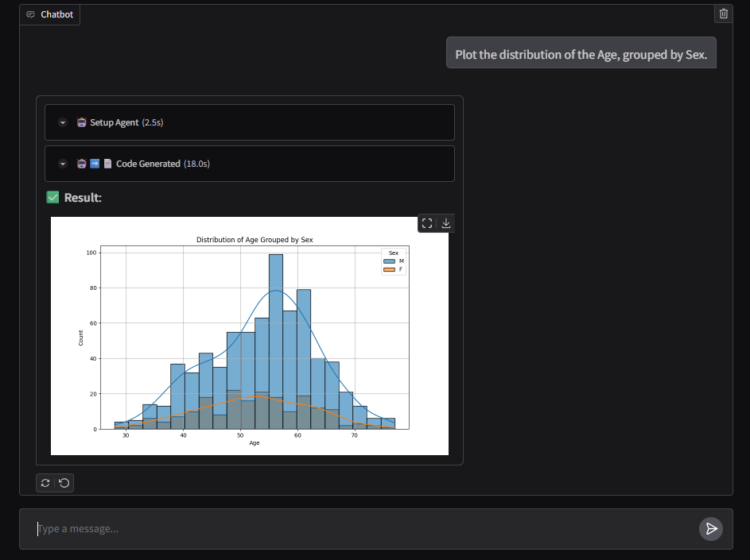

# FluentDB

## Project Goal
It is **[PandasAI](https://github.com/sinaptik-ai/pandas-ai) + [Gradio](https://www.gradio.app/)**.

A user-friendly python app that lets people "talk" to their databases using everyday language.

## Getting Started
1. Configure your LLM API setting here: `src/config/llm_config.py`.
2. Configure your dataset. Here the sample is `src/frontend/heart.csv`.
3. On your terminal run `python src/frontend/main.py` to launch a Gradio localhost website.

## Next Step
1. Add streaming of different stages of the agentic workflow for a better user experience.

## Note
This project is a modified fork of [PandasAI](https://github.com/sinaptik-ai/pandas-ai).
The original code from PandasAI used in this project is licensed under the MIT License.
See the [LICENSE](LICENSE) file for more details.